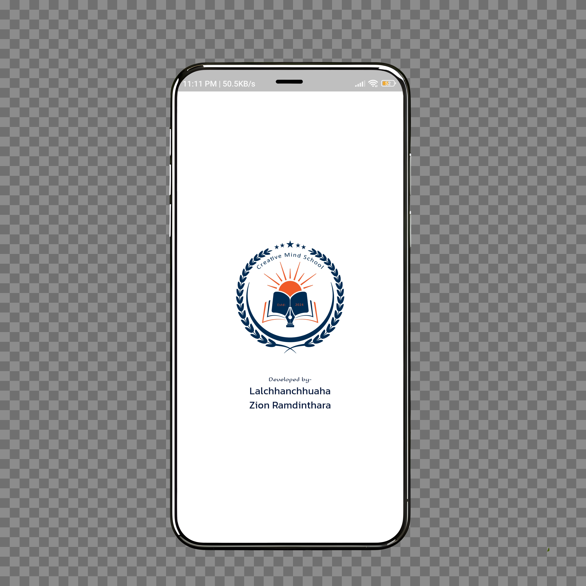
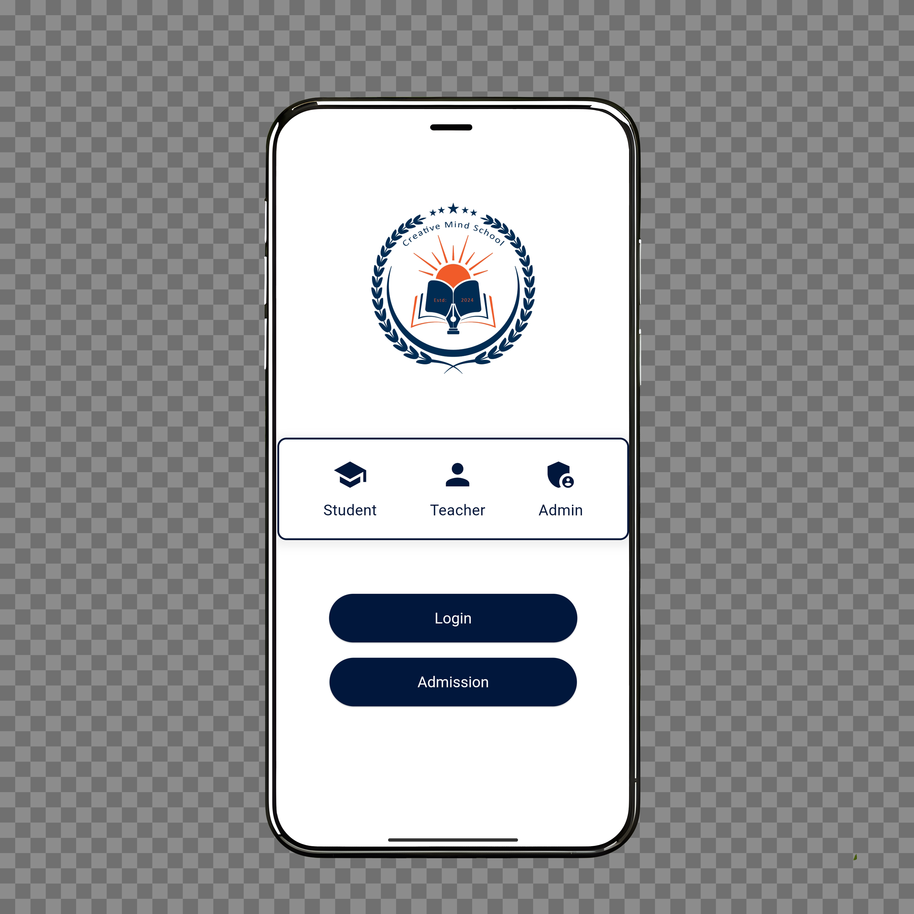

# cms_app

A new Flutter project.

## Getting Started

This project is a starting point for a Flutter application.

A few resources to get you started if this is your first Flutter project:

- [Lab: Write your first Flutter app](https://docs.flutter.dev/get-started/codelab)
- [Cookbook: Useful Flutter samples](https://docs.flutter.dev/cookbook)

For help getting started with Flutter development, view the
[online documentation](https://docs.flutter.dev/), which offers tutorials,
samples, guidance on mobile development, and a full API reference.

---

## 📸 App Screenshots  

  
  

---

## 🎥 App Demo  

### ** Direct Video Link (GitHub-Hosted)**
[Video](https://github.com/owensuka/Flutter-CMS_App/raw/main/assets/video/iphone-ball-turn.mp4)

---

## 🚀 Features
- Feature 1
- Feature 2
- Feature 3

---

## 🛠️ Installation
1. Clone the repository:
   ```sh
   git clone https://github.com/YOUR-GITHUB-USERNAME/Flutter-CMS_App.git

